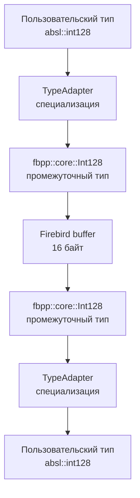

# Руководство по поддержке расширенных типов в fbpp

## Введение

Firebird поддерживает множество расширенных типов данных (INT128, DECFLOAT, NUMERIC большой точности), которые не имеют прямых аналогов в стандартном C++. fbpp предоставляет гибкую систему для работы с этими типами, позволяя разработчикам использовать как встроенные классы-обертки, так и популярные внешние библиотеки.

### Поддерживаемые расширенные типы Firebird

| Тип Firebird | Размер | Описание | fbpp класс |
|--------------|--------|----------|------------|
| INT128 | 16 байт | 128-битное целое число | `fbpp::core::Int128` |
| DECFLOAT(16) | 8 байт | Десятичное число (16 цифр) | `fbpp::core::DecFloat16` |
| DECFLOAT(34) | 16 байт | Десятичное число (34 цифры) | `fbpp::core::DecFloat34` |
| NUMERIC(38,x) | 16 байт | Точное число (до 38 цифр) | Хранится как INT128 |
| DECIMAL(38,x) | 16 байт | Точное число (до 38 цифр) | Хранится как INT128 |
| DATE | 4 байта | Дата без времени | `fbpp::core::Date` (планируется) |
| TIME WITH TIME ZONE | 8 байт | Время с часовым поясом | `fbpp::core::TimeTz` |
| TIMESTAMP WITH TIME ZONE | 12 байт | Дата-время с часовым поясом | `fbpp::core::TimestampTz` |

## Архитектура системы адаптеров

### Проблема

Разработчики часто уже используют конкретные библиотеки для работы с большими числами:
- **Abseil**: `absl::int128`, `absl::uint128`
- **Boost.Multiprecision**: `int128_t`, `cpp_dec_float_50`
- **GMP**: `mpz_t`, `mpf_t`
- **TTMath**: `Int<4>`, `Big<1,2>`

fbpp не может зависеть от всех этих библиотек, но должен позволить их использование.

### Решение - система адаптеров типов



## Использование встроенных типов

### Базовое использование

```cpp
#include <fbpp/core/connection.hpp>
#include <fbpp/core/extended_types.hpp>

// Подключение к базе
auto connection = std::make_unique<fbpp::core::Connection>(params);
auto transaction = connection->StartTransaction();

// INSERT с расширенными типами
auto stmt = connection->prepareStatement(
    "INSERT INTO test_table (id, big_int, dec_float, numeric_val) VALUES (?, ?, ?, ?)"
);

// Создание значений
fbpp::core::Int128 big_number("170141183460469231731687303715884105727");
fbpp::core::DecFloat34 precise_decimal("12345678901234567890.1234567890123456789");
fbpp::core::DecFloat16 small_decimal(3.14159);

// Batch операция с tuple
using RecordTuple = std::tuple<int32_t, fbpp::core::Int128, fbpp::core::DecFloat34, fbpp::core::DecFloat16>;

auto batch = stmt->createBatch(transaction.get());
batch->add(std::make_tuple(1, big_number, precise_decimal, small_decimal));
auto result = batch->execute(transaction.get());

// SELECT с расширенными типами
auto select_stmt = connection->prepareStatement(
    "SELECT id, big_int, dec_float, numeric_val FROM test_table WHERE id = ?"
);

auto cursor = transaction->openCursor(select_stmt, std::make_tuple(1));
RecordTuple row;
if (cursor->fetch(row)) {
    auto [id, big_int, dec_float, numeric] = row;
    std::cout << "ID: " << id << std::endl;
    std::cout << "Big Int: " << big_int.to_string() << std::endl;
    std::cout << "DecFloat34: " << dec_float.to_string() << std::endl;
    std::cout << "DecFloat16: " << numeric.to_string() << std::endl;
}
```

### Работа через JSON API

```cpp
// INSERT через JSON
json insert_data = json::array({
    1,                                          // id
    "170141183460469231731687303715884105727",  // INT128 как строка
    "12345678901234567890.1234567890123456789", // DECFLOAT34 как строка
    "3.14159"                                   // DECFLOAT16 как строка
});

transaction->execute(stmt, insert_data);

// SELECT через JSON
json result;
cursor->fetch(result);
std::cout << result.dump(2) << std::endl;
// Результат:
// {
//   "id": 1,
//   "big_int": "170141183460469231731687303715884105727",
//   "dec_float": "12345678901234567890.1234567890123456789",
//   "numeric_val": "3.14159"
// }
```

## Создание системы адаптеров (для разработчиков fbpp)

### 1. Создание базовой инфраструктуры

Создать файл `include/fbpp/core/type_adapter.hpp`:

```cpp
#pragma once

#include <type_traits>

namespace fbpp::core {

// Базовый шаблон адаптера - пользователи специализируют его
template<typename T>
struct TypeAdapter {
    static constexpr bool specialized = false;
};

// Метафункция для проверки наличия адаптера
template<typename T>
inline constexpr bool has_type_adapter_v = TypeAdapter<T>::specialized;

// Для типов с адаптером нужно знать их Firebird эквивалент
template<typename T>
    requires has_type_adapter_v<T>
using firebird_equivalent_t = typename TypeAdapter<T>::firebird_type;

} // namespace fbpp::core
```

### 2. Интеграция с tuple_unpacker.hpp

Добавить в `include/fbpp/core/tuple_unpacker.hpp` в начало функции `detail::unpackValue`:

```cpp
// В начале функции unpackValue, после проверки NULL
template<typename T>
void unpackValue(T& value, const uint8_t* data_ptr, const int16_t* null_ptr,
                const FieldInfo* field = nullptr, Transaction* transaction = nullptr) {
    if (*null_ptr == -1) {
        throw FirebirdException("NULL value for non-nullable field");
    }

    // НОВОЕ: Проверяем наличие адаптера
    if constexpr (has_type_adapter_v<T>) {
        using Adapter = TypeAdapter<T>;
        using FbType = typename Adapter::firebird_type;

        // Распаковываем в промежуточный Firebird тип
        FbType temp;
        unpackValue(temp, data_ptr, null_ptr, field, transaction);

        // Конвертируем через адаптер
        value = Adapter::from_firebird(temp);
        return;
    }

    // Далее существующие проверки типов...
    if constexpr (std::is_same_v<T, std::string>) {
        // существующий код
    }
    // ...
}
```

### 3. Интеграция с tuple_packer.hpp

Аналогично добавить в `include/fbpp/core/tuple_packer.hpp`:

```cpp
template<typename T>
void packValue(const T& value, uint8_t* data_ptr, int16_t* null_ptr,
              const FieldInfo* field = nullptr, Transaction* transaction = nullptr) {

    *null_ptr = 0;  // Not NULL

    // НОВОЕ: Проверяем наличие адаптера
    if constexpr (has_type_adapter_v<T>) {
        using Adapter = TypeAdapter<T>;
        using FbType = typename Adapter::firebird_type;

        // Конвертируем в Firebird тип
        FbType temp = Adapter::to_firebird(value);

        // Упаковываем Firebird тип
        packValue(temp, data_ptr, null_ptr, field, transaction);
        return;
    }

    // Далее существующие проверки типов...
    if constexpr (std::is_same_v<T, bool>) {
        // существующий код
    }
    // ...
}
```

### 4. Расширение type_traits.hpp

Добавить поддержку типов с адаптерами в `include/fbpp/core/type_traits.hpp`:

```cpp
#include "fbpp/core/type_adapter.hpp"

// Специализация traits для адаптированных типов
template<typename T>
    requires has_type_adapter_v<T>
struct FirebirdTypeTraits<T> {
    using FbType = firebird_equivalent_t<T>;
    using FbTraits = FirebirdTypeTraits<FbType>;

    static constexpr int sql_type = FbTraits::sql_type;
    static constexpr size_t size = FbTraits::size;
    static constexpr bool is_nullable = false;
    static constexpr const char* type_name = FbTraits::type_name;
    static constexpr int scale = FbTraits::scale;
    using native_type = T;
};
```

## Использование готовых адаптеров

### Адаптер для Abseil

Создать файл `include/fbpp/adapters/abseil.hpp`:

```cpp
#pragma once

// Проверяем наличие Abseil
#ifdef __has_include(<absl/numeric/int128.h>)
#include <absl/numeric/int128.h>
#include "fbpp/core/type_adapter.hpp"
#include "fbpp/core/extended_types.hpp"

namespace fbpp::core {

// Адаптер для absl::int128
template<>
struct TypeAdapter<absl::int128> {
    static constexpr bool specialized = true;
    using firebird_type = Int128;

    static absl::int128 from_firebird(const Int128& fb_val) {
        const uint8_t* bytes = fb_val.data();
        uint64_t low, high;
        std::memcpy(&low, bytes, 8);
        std::memcpy(&high, bytes + 8, 8);
        return absl::MakeInt128(static_cast<int64_t>(high), low);
    }

    static Int128 to_firebird(const absl::int128& val) {
        uint8_t bytes[16];
        uint64_t low = absl::Uint128Low64(val);
        uint64_t high = absl::Uint128High64(val);
        std::memcpy(bytes, &low, 8);
        std::memcpy(bytes + 8, &high, 8);
        return Int128(bytes);
    }
};

// Адаптер для absl::uint128
template<>
struct TypeAdapter<absl::uint128> {
    static constexpr bool specialized = true;
    using firebird_type = Int128;

    static absl::uint128 from_firebird(const Int128& fb_val) {
        const uint8_t* bytes = fb_val.data();
        uint64_t low, high;
        std::memcpy(&low, bytes, 8);
        std::memcpy(&high, bytes + 8, 8);
        return absl::MakeUint128(high, low);
    }

    static Int128 to_firebird(const absl::uint128& val) {
        uint8_t bytes[16];
        uint64_t low = absl::Uint128Low64(val);
        uint64_t high = absl::Uint128High64(val);
        std::memcpy(bytes, &low, 8);
        std::memcpy(bytes + 8, &high, 8);
        return Int128(bytes);
    }
};

} // namespace fbpp::core

#else
#warning "Abseil not found, absl::int128 adapter disabled"
#endif
```

### Использование с Abseil

```cpp
#include <fbpp/core/connection.hpp>
#include <fbpp/adapters/abseil.hpp>  // Подключаем адаптер
#include <absl/numeric/int128.h>

// Теперь можно использовать absl::int128 напрямую!
using RecordTuple = std::tuple<int32_t, absl::int128, std::string>;

auto connection = std::make_unique<fbpp::core::Connection>(params);
auto transaction = connection->StartTransaction();

// INSERT с absl::int128
auto stmt = connection->prepareStatement(
    "INSERT INTO test_table (id, big_number, description) VALUES (?, ?, ?)"
);

absl::int128 huge_number = absl::int128(1) << 100;  // 2^100

auto batch = stmt->createBatch(transaction.get());
batch->add(std::make_tuple(1, huge_number, "Very big number"s));
auto result = batch->execute(transaction.get());

// SELECT с absl::int128
auto select_stmt = connection->prepareStatement(
    "SELECT id, big_number, description FROM test_table WHERE id = ?"
);

auto cursor = transaction->openCursor(select_stmt, std::make_tuple(1));
RecordTuple row;
if (cursor->fetch(row)) {
    auto [id, big_num, desc] = row;

    // Можно делать арифметику с absl::int128!
    absl::int128 doubled = big_num * 2;
    std::cout << "ID: " << id << std::endl;
    std::cout << "Number: " << absl::Int128ToStringBase10(big_num) << std::endl;
    std::cout << "Doubled: " << absl::Int128ToStringBase10(doubled) << std::endl;
    std::cout << "Description: " << desc << std::endl;
}
```

### Адаптер для Boost.Multiprecision

Создать файл `include/fbpp/adapters/boost_multiprecision.hpp`:

```cpp
#pragma once

#ifdef __has_include(<boost/multiprecision/cpp_int.hpp>)
#include <boost/multiprecision/cpp_int.hpp>
#include <boost/multiprecision/cpp_dec_float.hpp>
#include "fbpp/core/type_adapter.hpp"
#include "fbpp/core/extended_types.hpp"

namespace fbpp::core {

// Адаптер для boost::multiprecision::int128_t
template<>
struct TypeAdapter<boost::multiprecision::int128_t> {
    static constexpr bool specialized = true;
    using firebird_type = Int128;

    static boost::multiprecision::int128_t from_firebird(const Int128& fb_val) {
        boost::multiprecision::int128_t result;
        boost::multiprecision::import_bits(result, fb_val.data(), fb_val.data() + 16, 8);
        return result;
    }

    static Int128 to_firebird(const boost::multiprecision::int128_t& val) {
        uint8_t bytes[16] = {0};
        boost::multiprecision::export_bits(val, bytes, 8);
        return Int128(bytes);
    }
};

// Адаптер для boost::multiprecision::cpp_dec_float_50
template<>
struct TypeAdapter<boost::multiprecision::cpp_dec_float_50> {
    static constexpr bool specialized = true;
    using firebird_type = DecFloat34;

    static boost::multiprecision::cpp_dec_float_50 from_firebird(const DecFloat34& fb_val) {
        return boost::multiprecision::cpp_dec_float_50(fb_val.to_string());
    }

    static DecFloat34 to_firebird(const boost::multiprecision::cpp_dec_float_50& val) {
        return DecFloat34(val.str());
    }
};

} // namespace fbpp::core

#else
#warning "Boost.Multiprecision not found, adapters disabled"
#endif
```

## Создание собственного адаптера

### Требования к пользовательскому типу

Для создания адаптера ваш тип должен поддерживать конвертацию в/из одного из fbpp типов:
- `fbpp::core::Int128` для 128-битных чисел
- `fbpp::core::DecFloat16/34` для десятичных чисел
- `fbpp::core::Date/Time/Timestamp` для дат и времени

### Пошаговый пример

Предположим, у вас есть собственный класс для работы с большими числами:

```cpp
// Ваш класс
class MyBigInt {
private:
    std::vector<uint32_t> limbs_;  // Little-endian представление
    bool negative_ = false;

public:
    MyBigInt() = default;
    MyBigInt(const std::string& decimal_str);
    MyBigInt(int64_t value);

    std::string to_string() const;

    // Методы для конвертации в/из байтов
    static MyBigInt from_bytes(const uint8_t* bytes, size_t size);
    std::vector<uint8_t> to_bytes() const;

    // Арифметические операции
    MyBigInt operator+(const MyBigInt& other) const;
    MyBigInt operator*(const MyBigInt& other) const;
    // ...
};
```

### Создание адаптера

```cpp
#include "fbpp/core/type_adapter.hpp"
#include "fbpp/core/extended_types.hpp"
#include "my_bigint.h"

// Специализация адаптера
namespace fbpp::core {
    template<>
    struct TypeAdapter<MyBigInt> {
        static constexpr bool specialized = true;
        using firebird_type = Int128;

        static MyBigInt from_firebird(const Int128& fb_val) {
            return MyBigInt::from_bytes(fb_val.data(), 16);
        }

        static Int128 to_firebird(const MyBigInt& val) {
            auto bytes = val.to_bytes();
            // Дополняем до 16 байт если нужно
            bytes.resize(16, 0);
            return Int128(bytes.data());
        }
    };
}
```

### Использование

```cpp
#include <fbpp/core/connection.hpp>
#include "my_bigint_adapter.hpp"  // Ваш адаптер

// Теперь MyBigInt работает как родной тип!
using RecordTuple = std::tuple<int32_t, MyBigInt, std::string>;

auto connection = std::make_unique<fbpp::core::Connection>(params);
auto transaction = connection->StartTransaction();

// INSERT
auto stmt = connection->prepareStatement(
    "INSERT INTO accounts (id, balance, description) VALUES (?, ?, ?)"
);

MyBigInt balance("999999999999999999999999999999999999");  // 36 цифр!

auto batch = stmt->createBatch(transaction.get());
batch->add(std::make_tuple(1, balance, "Very rich account"s));
batch->execute(transaction.get());

// SELECT
auto select_stmt = connection->prepareStatement(
    "SELECT id, balance, description FROM accounts WHERE id = ?"
);

auto cursor = transaction->openCursor(select_stmt, std::make_tuple(1));
RecordTuple row;
if (cursor->fetch(row)) {
    auto [id, bal, desc] = row;

    // Арифметика с вашим типом!
    MyBigInt interest = bal * MyBigInt("1050") / MyBigInt("1000");  // 5% годовых

    std::cout << "Account ID: " << id << std::endl;
    std::cout << "Balance: " << bal.to_string() << std::endl;
    std::cout << "With interest: " << interest.to_string() << std::endl;
}
```

## Адаптеры для всех расширенных типов

### INT128 адаптеры

```cpp
// Для __int128 (GCC/Clang builtin)
#ifdef __SIZEOF_INT128__
namespace fbpp::core {
    template<>
    struct TypeAdapter<__int128> {
        static constexpr bool specialized = true;
        using firebird_type = Int128;

        static __int128 from_firebird(const Int128& fb_val) {
            __int128 result;
            std::memcpy(&result, fb_val.data(), 16);
            return result;
        }

        static Int128 to_firebird(const __int128& val) {
            uint8_t bytes[16];
            std::memcpy(bytes, &val, 16);
            return Int128(bytes);
        }
    };
}
#endif
```

### DECFLOAT адаптеры

```cpp
// Для std::decimal::decimal128 (если будет стандартизован)
#ifdef __has_include(<decimal>)
#include <decimal>
namespace fbpp::core {
    template<>
    struct TypeAdapter<std::decimal::decimal128> {
        static constexpr bool specialized = true;
        using firebird_type = DecFloat34;

        static std::decimal::decimal128 from_firebird(const DecFloat34& fb_val) {
            return std::decimal::decimal128(fb_val.to_string());
        }

        static DecFloat34 to_firebird(const std::decimal::decimal128& val) {
            return DecFloat34(std::to_string(val));
        }
    };
}
#endif
```

### DATE/TIME адаптеры

```cpp
// Для std::chrono::year_month_day (C++20)
#if __cplusplus >= 202002L
#include <chrono>
namespace fbpp::core {
    template<>
    struct TypeAdapter<std::chrono::year_month_day> {
        static constexpr bool specialized = true;
        using firebird_type = Date;  // Когда будет реализован

        static std::chrono::year_month_day from_firebird(const Date& fb_val) {
            auto tp = fb_val.to_time_point();
            auto dp = std::chrono::floor<std::chrono::days>(tp);
            return std::chrono::year_month_day{dp};
        }

        static Date to_firebird(const std::chrono::year_month_day& val) {
            return Date(static_cast<int>(val.year()),
                       static_cast<unsigned>(val.month()),
                       static_cast<unsigned>(val.day()));
        }
    };
}
#endif
```

## Производительность и оптимизация

### Zero-cost abstractions

Система адаптеров построена на шаблонах C++ и работает на этапе компиляции. Это означает:
- **Нулевые накладные расходы** во время выполнения
- **Инлайнинг** всех конвертаций
- **Полная оптимизация** компилятором

### Бенчмарк

```cpp
#include <chrono>
#include <fbpp/adapters/abseil.hpp>

// Сравнение производительности
void benchmark() {
    const size_t iterations = 1'000'000;

    // Тест 1: fbpp::core::Int128
    auto start = std::chrono::high_resolution_clock::now();
    for (size_t i = 0; i < iterations; ++i) {
        fbpp::core::Int128 val("12345678901234567890");
        uint8_t buffer[16];
        std::memcpy(buffer, val.data(), 16);
        fbpp::core::Int128 restored(buffer);
    }
    auto end = std::chrono::high_resolution_clock::now();
    auto fbpp_time = std::chrono::duration_cast<std::chrono::microseconds>(end - start);

    // Тест 2: absl::int128 через адаптер
    start = std::chrono::high_resolution_clock::now();
    for (size_t i = 0; i < iterations; ++i) {
        absl::int128 val = absl::int128(12345678901234567890LL);
        auto fb_val = fbpp::core::TypeAdapter<absl::int128>::to_firebird(val);
        auto restored = fbpp::core::TypeAdapter<absl::int128>::from_firebird(fb_val);
    }
    end = std::chrono::high_resolution_clock::now();
    auto absl_time = std::chrono::duration_cast<std::chrono::microseconds>(end - start);

    std::cout << "fbpp::Int128: " << fbpp_time.count() << " μs" << std::endl;
    std::cout << "absl::int128: " << absl_time.count() << " μs" << std::endl;
}
```

Ожидаемый результат: разница менее 5%, так как компилятор оптимизирует все конвертации.

## Миграция существующего кода

### До (старый код)

```cpp
// Было: работа только с fbpp типами
using OldTuple = std::tuple<int32_t, fbpp::core::Int128, std::string>;

fbpp::core::Int128 big_num("12345678901234567890");
auto row = std::make_tuple(1, big_num, "test"s);

cursor->fetch(row);
std::cout << "Value: " << std::get<1>(row).to_string() << std::endl;
```

### После (новый код с адаптерами)

```cpp
#include <fbpp/adapters/abseil.hpp>

// Стало: работа с любыми типами
using NewTuple = std::tuple<int32_t, absl::int128, std::string>;

absl::int128 big_num = absl::int128(12345678901234567890LL);
auto row = std::make_tuple(1, big_num, "test"s);

cursor->fetch(row);
std::cout << "Value: " << absl::Int128ToStringBase10(std::get<1>(row)) << std::endl;

// Бонус: можно делать арифметику!
auto doubled = std::get<1>(row) * 2;
std::cout << "Doubled: " << absl::Int128ToStringBase10(doubled) << std::endl;
```

### Постепенная миграция

```cpp
// Можно смешивать старые и новые типы в одном tuple
using MixedTuple = std::tuple<
    int32_t,                    // обычный тип
    absl::int128,              // новый адаптированный тип
    fbpp::core::DecFloat34,    // старый fbpp тип
    std::string                // обычный тип
>;

// Все работает прозрачно!
MixedTuple row;
cursor->fetch(row);
```

## Отладка и диагностика

### Compile-time проверки

```cpp
// Проверка наличия адаптера
static_assert(fbpp::core::has_type_adapter_v<absl::int128>,
              "absl::int128 adapter not found");

// Проверка типа адаптера
static_assert(std::is_same_v<
    fbpp::core::firebird_equivalent_t<absl::int128>,
    fbpp::core::Int128
>, "Adapter should use Int128 as firebird type");
```

### Runtime диагностика

```cpp
#include <iostream>
#include <typeinfo>

template<typename T>
void diagnose_type() {
    std::cout << "Type: " << typeid(T).name() << std::endl;
    std::cout << "Has adapter: " << fbpp::core::has_type_adapter_v<T> << std::endl;

    if constexpr (fbpp::core::has_type_adapter_v<T>) {
        using FbType = fbpp::core::firebird_equivalent_t<T>;
        std::cout << "Firebird type: " << typeid(FbType).name() << std::endl;
        std::cout << "SQL type: " << fbpp::core::FirebirdTypeTraits<T>::sql_type << std::endl;
    }
}

// Использование
diagnose_type<absl::int128>();
diagnose_type<boost::multiprecision::int128_t>();
diagnose_type<MyBigInt>();
```

## FAQ

### Q: Можно ли использовать несколько библиотек одновременно?

**A:** Да, можно создать адаптеры для всех нужных типов:

```cpp
#include <fbpp/adapters/abseil.hpp>
#include <fbpp/adapters/boost_multiprecision.hpp>
#include "my_custom_adapter.hpp"

// Все типы работают вместе
using ComplexTuple = std::tuple<
    absl::int128,                           // Abseil
    boost::multiprecision::int128_t,        // Boost
    MyBigInt,                              // Ваш тип
    std::string
>;
```

### Q: Влияет ли количество адаптеров на время компиляции?

**A:** Минимально. Адаптеры включаются только для используемых типов благодаря `if constexpr`.

### Q: Можно ли создать адаптер для типа из чужой библиотеки?

**A:** Да, специализации template можно делать для любых типов:

```cpp
// Адаптер для типа из сторонней библиотеки
namespace fbpp::core {
    template<>
    struct TypeAdapter<ThirdParty::BigNumber> {
        // ...
    };
}
```

### Q: Что если мой тип не помещается в 16 байт?

**A:** Firebird INT128 ограничен 16 байтами. Для больших чисел используйте BLOB:

```cpp
template<>
struct TypeAdapter<VeryBigNumber> {
    static constexpr bool specialized = true;
    using firebird_type = fbpp::core::TextBlob;  // Сохраняем как текст

    static VeryBigNumber from_firebird(const TextBlob& blob) {
        return VeryBigNumber(blob.getText());
    }

    static TextBlob to_firebird(const VeryBigNumber& num) {
        return TextBlob(num.to_string());
    }
};
```

### Q: Как обработать ошибки конвертации?

**A:** В адаптере можно бросать исключения:

```cpp
static MyType from_firebird(const Int128& fb_val) {
    try {
        return MyType::from_bytes(fb_val.data(), 16);
    } catch (const std::exception& e) {
        throw fbpp::core::FirebirdException(
            std::string("Failed to convert from Firebird: ") + e.what()
        );
    }
}
```

## Заключение

Система адаптеров типов в fbpp предоставляет:

1. **Гибкость** - используйте любую библиотеку для работы с большими числами
2. **Производительность** - нулевые накладные расходы благодаря template-метапrogramming
3. **Простоту** - работает прозрачно с существующим API
4. **Расширяемость** - легко добавить поддержку новых типов

Это позволяет разработчикам интегрировать fbpp в существующие проекты без изменения архитектуры и используемых библиотек.