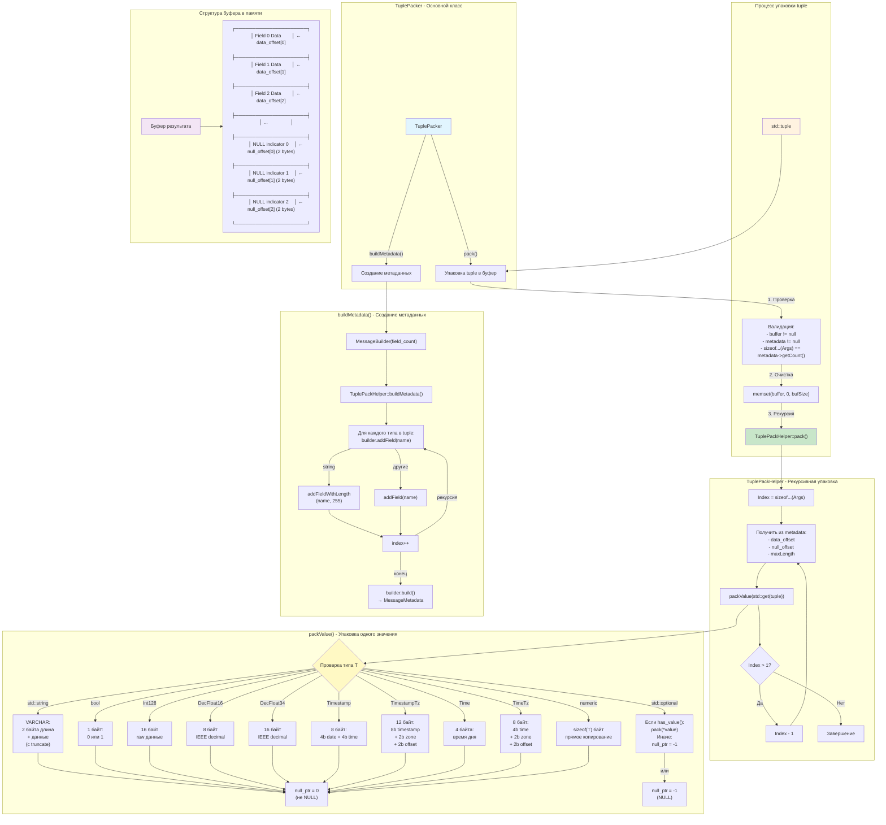

# TuplePacker Architecture

## Overview
`TuplePacker` is a template class that provides compile-time type-safe packing of C++ tuples into Firebird database message buffers.

## Architecture Diagram



## Key Components

### 1. **TuplePacker** - Main Template Class
- Takes variadic template parameters `Args...`
- Stores metadata and buffer size
- Provides `pack()` method to pack tuple into buffer
- Thread-safe for const operations

### 2. **TuplePackHelper** - Recursive Helper
- Uses compile-time recursion via template specialization
- Processes tuple elements from last to first
- Base case: `TuplePackHelper<0, Args...>` - empty implementation
- Index calculation: `idx = sizeof...(Args) - Index`

### 3. **packValue()** - Value Packing Function
- Overloaded for different types using `if constexpr`
- Special handling for `std::optional<T>` to support NULL values
- Handles string truncation with warnings
- Type-specific serialization:
  - **Strings**: 2-byte length prefix + UTF-8 data
  - **Bool**: Single byte (0 or 1)
  - **Int128**: 16 bytes raw data
  - **DecFloat16/34**: IEEE 754-2008 decimal format
  - **Timestamp**: Firebird format (date + time)
  - **Numeric types**: Direct memory copy

### 4. **Metadata Management**
- `MessageMetadata` provides field offsets and sizes
- NULL indicators stored separately (2 bytes per field)
- Support for maximum length constraints on VARCHAR fields
- Automatic field naming: `PARAM_0`, `PARAM_1`, etc.

## Memory Layout

The packed buffer follows Firebird's message format:

```
Buffer Layout:
┌──────────────────────────┐ Offset 0
│   Field 0 Data           │ 
├──────────────────────────┤ Offset N
│   Field 1 Data           │
├──────────────────────────┤ Offset M
│   Field 2 Data           │
├──────────────────────────┤
│   ...                    │
├──────────────────────────┤ NULL Offset Area
│   NULL Indicator 0 (2B)  │
├──────────────────────────┤
│   NULL Indicator 1 (2B)  │
├──────────────────────────┤
│   NULL Indicator 2 (2B)  │
└──────────────────────────┘
```

NULL Indicator values:
- `0`: Value is NOT NULL
- `-1`: Value is NULL

## Usage Example

```cpp
// Define data tuple
auto data = std::make_tuple(
    42,                        // INTEGER
    std::string("Hello"),      // VARCHAR
    3.14,                      // DOUBLE
    std::optional<int>(),      // NULL INTEGER
    Timestamp::now(),          // TIMESTAMP
    Int128(123456789),         // INT128
    DecFloat34("123.456")      // DECFLOAT(34)
);

// Create packer
TuplePacker<int, std::string, double, std::optional<int>, 
            Timestamp, Int128, DecFloat34> packer;

// Get metadata from prepared statement
auto stmt = connection->prepareStatement("INSERT INTO test VALUES (?, ?, ?, ?, ?, ?, ?)");
auto metadata = stmt->getInputMetadata();

// Pack into buffer
std::vector<uint8_t> buffer(metadata->getMessageLength());
packer.pack(data, buffer.data(), metadata);

// Execute with packed buffer
stmt->execute(transaction, metadata, buffer.data());
```

## Type Support

### Primitive Types
- `int16_t`, `int32_t`, `int64_t`
- `float`, `double`
- `bool`
- `const char*`, `std::string`

### Extended Types
- `Int128` - 128-bit integer
- `DecFloat16` - DECFLOAT(16) 
- `DecFloat34` - DECFLOAT(34)
- `Timestamp` - Date and time
- `TimestampTz` - Timestamp with timezone
- `Time` - Time of day
- `TimeTz` - Time with timezone
- `Blob` - Binary large object reference

### Optional Types
- `std::optional<T>` for any supported type T
- Properly handles NULL database values

## Implementation Details

### Compile-Time Recursion
The packer uses template metaprogramming to unroll the tuple at compile time:

```cpp
template<size_t Index, typename... Args>
struct TuplePackHelper {
    static void pack(const std::tuple<Args...>& tuple, 
                    uint8_t* buffer, 
                    const MessageMetadata* metadata) {
        // Pack current element
        packValue(std::get<idx>(tuple), ...);
        
        // Recursive call for remaining elements
        if constexpr (Index > 1) {
            TuplePackHelper<Index - 1, Args...>::pack(tuple, buffer, metadata);
        }
    }
};
```

### String Truncation
Strings longer than the database field length are automatically truncated with a warning:

```cpp
if (maxLength > 0 && actualLen > maxLength) {
    actualLen = maxLength;
    logger->warn("String truncated from {} to {} bytes", 
                 value.length(), maxLength);
}
```

### Error Handling
- Validates buffer and metadata pointers
- Checks tuple arity matches metadata field count
- Throws `FirebirdException` on errors
- Provides detailed error messages with field indices

## Performance Considerations

1. **Zero-copy for primitive types**: Direct memory copy for numeric types
2. **Compile-time optimization**: Template recursion unrolled at compile time
3. **Buffer pre-clearing**: Single memset for entire buffer
4. **Minimal allocations**: Works with pre-allocated buffers

## Thread Safety

- `TuplePacker` instances are thread-safe for const operations
- `pack()` method is const and can be called concurrently
- No internal state modification during packing
- Metadata building is lazy and protected

## Future Enhancements

1. Support for custom type serialization via traits
2. Batch packing optimization for multiple tuples
3. Compile-time validation of type compatibility
4. Support for nested tuples and structures