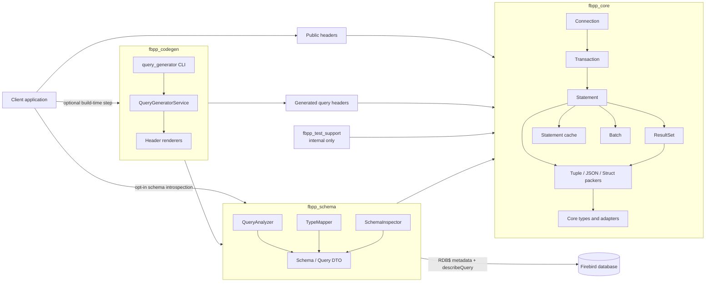

# fbpp

## Что это

`fbpp` - это прикладная C++20-библиотека поверх Firebird 5 OO API. Она не пытается закрыть весь административный и сервисный API Firebird и не является ORM. Основная задача библиотеки - дать предсказуемый runtime для DSQL-сценариев:

- подключение к базе и управление транзакциями
- подготовка и повторное использование SQL-выражений
- выполнение `INSERT`, `UPDATE`, `DELETE`, `SELECT`, `RETURNING`
- упаковка и распаковка параметров и результатов
- работа с расширенными типами Firebird
- чтение metadata схемы базы: tables, views, procedures, sequences
- генерация типизированных query descriptors и структур по SQL и метаданным базы

Ключевая идея: SQL остаётся явным, а библиотека даёт тонкий слой поверх Firebird attachment / transaction / statement / result set и единый механизм отображения типов.

## Состав библиотеки

| Слой | Назначение | Публичность |
| --- | --- | --- |
| `fbpp_core` | Runtime wrapper, типы, pack/unpack, named parameters, batch, cache, query executor | публичный |
| `fbpp_schema` | `QueryAnalyzer`, `TypeMapper`, `SchemaInspector`, schema/query DTO | публичный |
| `fbpp_codegen` | `QueryGeneratorService`, генерация заголовков, CLI `query_generator` | публичный |
| `fbpp_test_support` | `connection_helper`, тестовые конфиги, вспомогательная DB-инфраструктура | внутренний, не устанавливается |

### Публичные include-входы

- `<fbpp/fbpp.hpp>` - минимальный runtime surface
- `<fbpp/fbpp_extended.hpp>` - runtime + core extended types Firebird
- `<fbpp/fbpp_all.hpp>` - convenience umbrella, включая adapters и packer helpers
- `<fbpp/schema/query_analyzer.hpp>` - публичный анализ SQL и query metadata
- `<fbpp/schema/type_mapper.hpp>` - публичный Firebird -> C++ type mapping
- `<fbpp/schema/schema_types.hpp>` - DTO для relation/procedure/sequence metadata
- `<fbpp/schema/schema_inspector.hpp>` - read-only schema introspection API
- `<fbpp/query_generator_service.hpp>` - API слоя codegen

### CMake components

- `find_package(fbpp CONFIG REQUIRED)` - по умолчанию подключает только `core`
- `find_package(fbpp CONFIG REQUIRED COMPONENTS schema)` - подключает `core` + `schema`
- `find_package(fbpp CONFIG REQUIRED COMPONENTS codegen)` - подключает `core` + `schema` + `codegen`

Импортируемые target'ы:

- `fbpp::fbpp_core`
- `fbpp::fbpp_schema`
- `fbpp::fbpp_codegen`
- `fbpp::fbpp` - compatibility alias к `fbpp::fbpp_core`

### Базовый runtime-контракт

- `Connection` представляет attachment к Firebird.
- `Transaction` живёт поверх одного `Connection`.
- `Statement` - подготовленный SQL-объект.
- `ResultSet` - последовательный cursor для чтения строк.
- Параметры и результаты проходят через метаданные Firebird message buffers.
- Один `Connection` предполагается использовать из одного потока; связанные `Transaction`, `Statement` и `ResultSet` наследуют эту thread affinity.

## Архитектура



## Как библиотека работает

### 1. Runtime слой

Обычный путь выполнения выглядит так:

1. создать `Connection` из `ConnectionParams`
2. открыть `Transaction`
3. подготовить `Statement`
4. передать входные данные как tuple, JSON или struct
5. библиотека читает input metadata Firebird и упаковывает значения в message buffer
6. Firebird выполняет statement
7. для `SELECT` и `RETURNING` библиотека читает output metadata и распаковывает данные обратно в tuple, JSON или struct

`fbpp` строится вокруг message metadata. Типы не угадываются по SQL-строке вручную в пользовательском коде; реальные offsets, null indicators, scale и subtype берутся из Firebird metadata.

### 2. Schema/introspection слой

`fbpp_schema` - это отдельный opt-in слой поверх `fbpp_core`, предназначенный для tooling и build-time сценариев.

Он даёт три публичных capability:

- `QueryAnalyzer` - анализирует SQL, делает rewrite named parameters и вытаскивает input/output metadata через `Connection::describeQuery()`
- `TypeMapper` - применяет те же правила Firebird -> C++ type mapping, что и codegen
- `SchemaInspector` - читает `RDB$*` system tables и отдаёт read-only metadata по tables, views, procedures и sequences

Важные ограничения текущей версии:

- lookups в `SchemaInspector` ориентированы на обычные некавыченные Firebird identifiers и upper-case normalisation
- quoted identifiers с сохранённым регистром и спецсимволами в v1 не поддержаны
- `SequenceInfo::currentValue` - это raw internal counter, эквивалент `GEN_ID(name, 0)`, а не "следующее пользовательское значение"

Каждый вызов `SchemaInspector` открывает свою транзакцию, не кэширует Firebird resources между вызовами и не меняет runtime contract `Connection`.

### 3. Типизированный слой поверх runtime

Если SQL уже стабилен и нужен compile-time friendly API, поверх runtime используется `query_executor.hpp` и/или `fbpp_codegen`. В этом случае runtime остаётся тем же, но input/output описываются структурами и `QueryDescriptor`.

## Степень покрытия Firebird API

Покрытие у `fbpp` высокое для прикладного DSQL runtime и намеренно неполное для административных подсистем Firebird.

| Область Firebird API | Статус | Комментарий |
| --- | --- | --- |
| Attach / detach database | покрыто | `Connection` |
| Create / drop database | покрыто | статические методы `Connection` |
| Transactions | покрыто | `StartTransaction`, `Commit`, `Rollback`, retaining-варианты |
| Prepared statements | покрыто | `prepareStatement`, повторное использование, cache |
| DSQL execute / open cursor / returning | покрыто | runtime API через `Statement`, `Transaction`, `ResultSet` |
| Statement metadata | покрыто | `MessageMetadata`, используется и в runtime, и в codegen |
| Named parameters | покрыто | клиентский rewrite в positional SQL |
| Batch DML | покрыто | `Batch` |
| Cancel operations | покрыто | `Connection::cancelOperation`, `Batch::cancel` |
| BLOB read / write | частично | есть чтение и запись целиком; streaming API по сегментам наружу не вынесен |
| Extended scalar types Firebird 5 | покрыто | `INT128`, `DECFLOAT`, `TIME/TIMESTAMP WITH TIME ZONE` и др. |
| Query analysis / type mapping for tooling | покрыто | `fbpp_schema`: `QueryAnalyzer`, `TypeMapper` |
| Schema inspection / database metadata | частично | `fbpp_schema`: tables, views, indexes, constraints, procedures, sequences; quoted identifiers не поддержаны в v1 |
| Query/schema generation | покрыто | `fbpp_codegen` поверх `fbpp_schema`, `query_generator`, generated descriptors |
| Firebird Services API | не покрыто | backup/restore, users, sweep и т.п. вне scope |
| Events API | не покрыто | подписки на события не реализованы |
| Monitoring / admin surface | не покрыто | библиотека не позиционируется как admin toolkit |
| Connection pool / async / coroutines | не покрыто | это не часть текущего runtime contract |

Итого: библиотека закрывает основной application-facing слой Firebird OO API, но не претендует на полноту по всему серверному и административному стеку.

## Работа с типами

### Формы данных на границе API

`fbpp` поддерживает три основных формы обмена данными:

- tuple
- `nlohmann::json`
- struct с `StructDescriptor`

### Tuple

Tuple - это минимальный и быстрый путь, если порядок полей уже известен и не нужны имена.

- вход: positional parameters
- выход: positional row mapping
- хорош для низкоуровневого runtime и небольших запросов

### JSON

JSON нужен, когда важна динамика:

- массивы работают как positional parameters
- объекты удобны для named parameters
- результаты читаются как объект по именам полей и алиасов

JSON API использует те же Firebird metadata, что и tuple/struct path. Это не отдельный способ выполнения запросов, а альтернативный слой упаковки значений.

### Struct

Struct path нужен для долгоживущего API и compile-time контракта. Для этого:

- пользователь описывает структуру
- `StructDescriptor` связывает поля структуры с SQL-полями
- runtime pack/unpack и `query_executor` используют этот descriptor

Именно этот путь делает сгенерированные query descriptors полезными: входы и выходы становятся обычными C++-структурами.

## Core types и adapters

В библиотеке есть два уровня типизации.

### 1. Core types

Это типы, которые принадлежат самой библиотеке и не требуют внешних numeric/date-time библиотек:

- `fbpp::core::Int128`
- `fbpp::core::DecFloat16`
- `fbpp::core::DecFloat34`
- `fbpp::core::Date`, `Time`, `Timestamp`
- `fbpp::core::TimeTz`, `TimestampTz`
- `fbpp::core::Blob`, `TextBlob`

Эти типы подключаются через `<fbpp/fbpp_extended.hpp>`.

### 2. Optional adapters

Это opt-in отображения Firebird-типов в внешние C++-типы:

| Firebird type | Core representation | Optional adapter |
| --- | --- | --- |
| `INT128` | `fbpp::core::Int128` | `ttmath::Int<2>` через `ttmath_int128.hpp` |
| `NUMERIC(38,x)` / `DECIMAL(38,x)` | core extended numeric path | `TTNumeric<...>` через `ttmath_numeric.hpp` |
| `DECFLOAT(16/34)` | `DecFloat16` / `DecFloat34` | `dec::DecDouble` / `dec::DecQuad` через `cppdecimal_decfloat.hpp` |
| `DATE`, `TIME`, `TIMESTAMP`, `TIMESTAMP WITH TIME ZONE` | core date/time wrappers | `std::chrono` adapter через `chrono_datetime.hpp` |
| `TEXT BLOB` | `TextBlob` или blob ID | генератор может маппить в `std::string` через `--use-string-blob` |

### Практическое правило

- если нужен минимальный dependency surface, используйте core types
- если проект уже живёт на `ttmath`, `cppdecimal` или `std::chrono`, включайте adapters и/или codegen flags
- если нужен тот же mapping в tooling или генераторе, используйте `fbpp::schema::TypeMapper`
- `fbpp_codegen` использует те же правила отображения типов, что и runtime, поэтому generated API и ручной runtime API остаются совместимыми

## Генератор схем запросов

Под "генератором схем" в `fbpp` понимается не генератор миграций и не ORM-schema builder. Это генератор typed query schema:

- на входе есть набор SQL-запросов
- generator подключается к живой базе
- через `fbpp_schema` анализирует SQL и читает input/output metadata для каждого запроса
- генерирует C++-структуры и `QueryDescriptor`

То есть он строит схему входов и выходов запросов, а не схему базы данных целиком.

### Вход

Обычный входной файл - JSON-объект вида:

```json
{
  "InsertOrder": "INSERT INTO ORDERS (ID, NAME) VALUES (:ID, :NAME)",
  "SelectOrderById": "SELECT ID, NAME FROM ORDERS WHERE ID = :ID"
}
```

Имена ключей становятся именами query entities в generated code. SQL можно писать как с positional `?`, так и с named parameters.

### Выход

Генератор создаёт два заголовка:

- основной header с `QueryId`, `QueryDescriptor`, SQL-строками и aliases
- support header со структурами входов/выходов и `StructDescriptor` specialization

Именно поэтому generated слой остаётся совместим с runtime:

- runtime продолжает исполнять prepared statements
- generated код лишь фиксирует schema и mapping на compile time

### Что генерируется

Для каждого запроса библиотека может вывести:

- `enum class QueryId`
- `QueryDescriptor<QueryId::...>`
- `...In` и `...Out` структуры
- `StructDescriptor<...>` для этих структур
- позиционный SQL, если исходный запрос был с named parameters

### Настройки type mapping

`fbpp_codegen` использует тот же `AdapterConfig`, что и `fbpp_schema::TypeMapper`:

- `useTTMathNumeric`
- `useTTMathInt128`
- `useChronoDatetime`
- `useCppDecimalDecFloat`
- `useStringForTextBlob`
- `generateAliases`

Это позволяет синхронно настроить generated API под выбранную типовую модель приложения.

### CLI

CLI `query_generator` работает поверх того же `QueryGeneratorService`:

```bash
query_generator \
  --dsn firebird5:/db.fdb \
  --input queries.json \
  --output queries.generated.hpp \
  --support queries.structs.generated.hpp \
  --use-ttmath-numeric \
  --use-ttmath-int128 \
  --use-chrono \
  --use-cppdecimal
```

### Когда использовать generator, а когда нет

Generator полезен, если:

- набор SQL относительно стабилен
- нужен compile-time контракт на входы/выходы
- хочется убрать ручное сопровождение `StructDescriptor`

Ручной runtime API лучше, если:

- SQL формируется динамически
- схема результата нестабильна
- важнее минимальный слой abstraction, чем generated code

## Минимальная карта выбора API

- нужен только runtime и ручные SQL-вызовы: `<fbpp/fbpp.hpp>`
- нужен runtime + core extended types: `<fbpp/fbpp_extended.hpp>`
- нужен convenience include с adapters: `<fbpp/fbpp_all.hpp>`
- нужен анализ SQL, type mapping или read-only schema metadata: component `schema` и заголовки из `<fbpp/schema/...>`
- нужен typed query/schema generator: `fbpp_codegen` и `<fbpp/query_generator_service.hpp>`

## Канонический документ

Этот файл является единственным поддерживаемым обзорным документом по библиотеке. Детали, которые раньше были разнесены по отдельным планам, заметкам и частным архитектурным описаниям, больше не считаются отдельным публичным contract surface.
