# План реализации Firebird MCP support module для `fbpp`

## Назначение документа

Этот документ описывает план реализации нового модуля, который должен дать библиотеке `fbpp` достаточный набор возможностей для построения MCP-сервера уровня `merpHelper`, но без нарушения текущей архитектуры библиотеки.

Речь идёт не о встраивании самого MCP-сервера в `fbpp_core`, а о создании устойчивого public API для:

- анализа SQL against live Firebird database
- инспекции схемы базы
- type mapping Firebird -> C++
- генерации typed query/schema artifacts
- удобной сериализации metadata для внешнего tooling

Сам MCP transport, registry запросов, snapshots, template repository и protocol handlers должны жить отдельно от runtime-слоя библиотеки.

## Исходные ограничения

Новый модуль должен соблюдать уже принятые принципы организации `fbpp`.

### Что нельзя ломать

- `fbpp_core` остаётся runtime-слоем: attachment, transaction, statement, result set, batch, pack/unpack, types.
- `fbpp_codegen` остаётся tooling/codegen-слоем поверх runtime.
- `fbpp_test_support` не попадает в install surface.
- process-wide singleton-конфигурация не возвращается в runtime API.
- stable include surface не размывается; минимальный core include остаётся минимальным.
- MCP-specific зависимости и storage-инфраструктура не попадают в core package.

### Что важно сохранить

- SQL остаётся явным контрактом.
- Метаданные и type mapping должны опираться на реальную Firebird metadata, а не на эвристику по строке.
- Codegen и ручной runtime path должны использовать один и тот же metadata contract.

## Принципы внедрения в текущую архитектуру

Новый модуль должен встраиваться в библиотеку по тем же правилам, по которым уже разведены `fbpp_core`, `fbpp_codegen` и `fbpp_test_support`.

### Архитектурные правила

- `fbpp_core` не получает новых high-level tooling обязанностей.
- новый слой metadata/introspection не тянет в себя test infrastructure и примерный код.
- `fbpp_codegen` худеет и начинает зависеть от переиспользуемого schema-layer, а не от собственной внутренней ad-hoc логики.
- umbrella headers не расширяются автоматически; новый слой подключается только opt-in include-ами.
- все новые DTO и сервисы должны быть пригодны и для codegen, и для будущего внешнего MCP-server, без форка моделей данных.

### Что считается нарушением архитектуры

- добавление schema inspection API в `fbpp_core` public umbrella header
- появление MCP-specific storage или transport кода в installable library target
- дублирование type mapping отдельно в codegen и отдельно в новом модуле
- появление process-wide глобальных конфигураций для schema/codegen path
- зависимость runtime execution path от JSON/template/MCP helper-слоёв

## Что именно нужно получить

Чтобы реализовать Firebird MCP уровня `merpHelper`, библиотека должна уметь давать наружу следующие capability.

1. Инспекция схемы базы.
2. Анализ произвольного SQL с извлечением input/output metadata.
3. Генерация CRUD SQL по таблице.
4. Стабильный type mapping Firebird -> C++.
5. JSON-friendly DTO для metadata и codegen context.
6. Переиспользуемый слой, на котором можно построить:
   - query registry
   - MCP tools
   - шаблонный code generation
   - внешние UI/CLI средства

## Что должно остаться вне библиотеки

Следующие части не должны попадать в `fbpp_core` и не должны быть обязательной частью `fbpp` как installable runtime product:

- MCP protocol server
- хранение query registry в SQLite / Firebird / любой другой БД
- snapshots/restore query definitions
- naming conventions уровня конкретного проекта
- custom template repository
- project-specific file generators

Для них библиотека должна дать API-основание, но сами реализации должны остаться во внешнем модуле, например:

- отдельный репозиторий
- отдельная optional target-группа `tools/`
- отдельный пакет вроде `fbpp_firebird_mcp`

## Карта изменений по текущему репозиторию

План должен учитывать уже существующее разбиение проекта, а не предлагать абстрактную новую архитектуру с нуля.

### Что затронет реализация

- [CMakeLists.txt](/C:/VStudioProjects/fbpp/CMakeLists.txt)
  - добавление target `fbpp_schema`
  - обновление install/export/components
  - подключение package smoke tests для нового компонента
- [query_generator_service.hpp](/C:/VStudioProjects/fbpp/include/fbpp/query_generator_service.hpp)
  - сохранение public API сервиса
  - постепенный перевод реализации на `fbpp_schema`
- [query_generator_service.cpp](/C:/VStudioProjects/fbpp/src/core/firebird/query_generator_service.cpp)
  - выделение type mapping и query analysis в отдельный слой
  - сохранение только orchestration и rendering responsibilities
- [connection.hpp](/C:/VStudioProjects/fbpp/include/fbpp/core/connection.hpp)
  - использовать существующий `describeQuery()` как low-level primitive
  - не раздувать runtime API schema-specific методами
- `include/fbpp/schema/*` и `src/schema/*`
  - новая публичная и реализационная структура модуля
- `tests/unit/*` и `tests/package_smoke/*`
  - покрытие нового слоя и проверка install-tree usage

### Что не должно затрагиваться напрямую

- runtime классы `Transaction`, `Statement`, `ResultSet`, кроме минимальных внутренних extract-helper-ов при необходимости
- `fbpp_test_support` как installable surface
- существующие minimal umbrella headers `<fbpp/fbpp.hpp>` и `<fbpp/fbpp_extended.hpp>`, кроме точечных include-cleanup при необходимости

## Целевая архитектура

### Рекомендуемое разбиение слоёв

Предлагаемая эволюция:

- `fbpp_core`
  - без смены роли
- `fbpp_schema`
  - новый публичный слой schema/introspection/tooling metadata
- `fbpp_codegen`
  - поверх `fbpp_schema`, а не напрямую поверх ad-hoc логики
- `fbpp_test_support`
  - без изменений
- внешний `fbpp_firebird_mcp`
  - отдельный серверный слой поверх `fbpp_schema` + `fbpp_codegen`

### Почему нужен отдельный `fbpp_schema`

Если положить schema inspection, query analysis и type mapping прямо в `fbpp_core`, runtime-слой станет смешанным: и execution runtime, и developer tooling. Это размоет архитектуру.

Если оставить всё внутри `fbpp_codegen`, codegen target начнёт нести на себе слишком разные роли:

- low-level metadata analysis
- type mapping
- schema inspection
- header rendering

Это затруднит reuse в MCP и внешних tools.

Поэтому оптимальный путь:

- `fbpp_core` = выполнение запросов и runtime metadata primitives
- `fbpp_schema` = high-level metadata/introspection API
- `fbpp_codegen` = header/code generation поверх `fbpp_schema`

## Целевая схема зависимостей

```mermaid
flowchart LR
    App[Client tooling / MCP server] --> MCP[fbpp_firebird_mcp]
    App --> Codegen
    App --> Schema
    App --> Core

    subgraph Core["fbpp_core"]
        Conn[Connection]
        Tx[Transaction]
        Stmt[Statement]
        Meta[MessageMetadata / FieldInfo]
    end

    subgraph Schema["fbpp_schema"]
        Inspector[SchemaInspector]
        Analyzer[QueryAnalyzer]
        Mapper[TypeMapper]
        Crud[CrudSqlBuilder]
        Dto[Schema / Query DTO]
    end

    subgraph Codegen["fbpp_codegen"]
        QGS[QueryGeneratorService]
        Render[Header renderers]
        Ctx[Template context builders]
    end

    subgraph MCP["fbpp_firebird_mcp (outside core package)"]
        Tools[MCP tools]
        Catalog[Query catalog storage]
        Snapshots[Snapshots]
        Templates[Template repository]
    end

    Schema --> Core
    Codegen --> Schema
    MCP --> Schema
    MCP --> Codegen
```



## Планируемая структура пакетов и include surface

### CMake targets

Новые public components:

- `fbpp_core`
- `fbpp_schema`
- `fbpp_codegen`

Алиасы:

- `fbpp::fbpp_core`
- `fbpp::fbpp_schema`
- `fbpp::fbpp_codegen`

Совместимость:

- `fbpp::fbpp` остаётся alias к `fbpp_core`

### Public headers

Предлагаемая структура:

- `include/fbpp/schema/query_analysis.hpp`
- `include/fbpp/schema/query_analyzer.hpp`
- `include/fbpp/schema/schema_types.hpp`
- `include/fbpp/schema/schema_inspector.hpp`
- `include/fbpp/schema/type_mapper.hpp`
- `include/fbpp/schema/crud_sql_builder.hpp`
- `include/fbpp/schema/json_serialization.hpp`
- `include/fbpp/schema/template_context.hpp`

Важно:

- не добавлять эти заголовки в `<fbpp/fbpp.hpp>`
- не раздувать `<fbpp/fbpp_extended.hpp>`
- при необходимости позже можно добавить отдельный `<fbpp/fbpp_schema.hpp>`, но на первом этапе это не обязательно

## Обязательные новые API

## 1. Query analysis API

Этот слой является аналогом `McpQueryAnalyzer`, но должен строиться на существующем `fbpp` runtime и metadata abstractions.

### Новые DTO

```cpp
namespace fbpp::schema {

enum class QueryKind {
    select_query,
    insert_query,
    update_query,
    delete_query,
    execute_procedure,
    execute_block,
    ddl,
    unknown
};

struct QueryParameterInfo {
    std::string sqlName;
    std::string memberName;
    fbpp::core::FieldInfo field;
    std::size_t ordinal = 0;
    bool repeated = false;
};

struct QueryResultFieldInfo {
    std::string sqlName;
    std::string memberName;
    fbpp::core::FieldInfo field;
    std::size_t ordinal = 0;
};

struct QueryAnalysis {
    std::string originalSql;
    std::string positionalSql;
    QueryKind kind = QueryKind::unknown;
    bool hasNamedParameters = false;
    std::vector<QueryParameterInfo> inputParams;
    std::vector<QueryResultFieldInfo> outputFields;
};

}
```

### Новый сервис

```cpp
namespace fbpp::schema {

class QueryAnalyzer {
public:
    explicit QueryAnalyzer(fbpp::core::Connection& connection);

    QueryAnalysis analyze(std::string_view sql) const;
    std::vector<QueryParameterInfo> analyzeInputParams(std::string_view sql) const;
    std::vector<QueryResultFieldInfo> analyzeOutputFields(std::string_view sql) const;
};

}
```

### Источник данных

Нужно использовать:

- existing named parameter parser
- `Connection::describeQuery()`
- `MessageMetadata` / `FieldInfo`

Важное требование:

- `QueryAnalyzer` не должен зависеть от header generation
- `QueryGeneratorService` должен начать использовать именно `QueryAnalyzer`

## 2. Type mapping API

Сейчас эта логика спрятана внутри `query_generator_service.cpp`. Для MCP и tooling её нужно сделать публичной и переиспользуемой.

### Новый API

```cpp
namespace fbpp::schema {

using AdapterConfig = fbpp::core::AdapterConfig;

struct CppTypeInfo {
    std::string cppType;
    bool needsOptional = false;
    bool needsString = false;
    bool needsExtendedTypes = false;
    bool needsTTMath = false;
    bool needsChrono = false;
    bool needsCppDecimal = false;
    std::optional<fbpp::core::TypeMapping::ScaledNumericInfo> scaledInfo;
};

class TypeMapper {
public:
    static CppTypeInfo mapField(const fbpp::core::FieldInfo& field,
                                bool isOutput,
                                const AdapterConfig& config = {});
};

}
```

### Требования

- логика должна быть единой для runtime-related tooling и codegen
- поддерживать core types и optional adapters
- корректно обрабатывать:
  - nullable
  - scale / precision
  - BLOB subtype
  - `TIME/TIMESTAMP WITH TIME ZONE`
  - `INT128`, `DECFLOAT`

## 3. Schema inspection API

Это главный недостающий слой для MCP.

### DTO схемы

Минимальный набор:

```cpp
namespace fbpp::schema {

struct ColumnInfo {
    std::string schemaName;
    std::string relationName;
    std::string columnName;
    fbpp::core::FieldInfo field;
    bool isPrimaryKey = false;
    bool isForeignKey = false;
    bool isIdentity = false;
    bool isComputed = false;
    bool hasDefault = false;
    std::string defaultSource;
    std::string generatorName;
    std::string domainName;
};

struct PrimaryKeyInfo {
    std::string name;
    std::vector<std::string> columns;
};

struct ForeignKeyInfo {
    std::string name;
    std::vector<std::string> columns;
    std::string referencedSchema;
    std::string referencedRelation;
    std::vector<std::string> referencedColumns;
};

struct IndexInfo {
    std::string name;
    bool unique = false;
    bool descending = false;
    bool active = true;
    std::vector<std::string> columns;
};

struct TableInfo {
    std::string schemaName;
    std::string relationName;
    bool isView = false;
    std::vector<ColumnInfo> columns;
    std::optional<PrimaryKeyInfo> primaryKey;
    std::vector<ForeignKeyInfo> foreignKeys;
    std::vector<IndexInfo> indexes;
};

struct ProcedureParamInfo {
    std::string paramName;
    std::string direction; // input / output
    fbpp::core::FieldInfo field;
    std::size_t ordinal = 0;
};

struct ProcedureInfo {
    std::string schemaName;
    std::string procedureName;
    bool selectable = false;
    std::vector<ProcedureParamInfo> inputParams;
    std::vector<ProcedureParamInfo> outputParams;
};

struct SequenceInfo {
    std::string sequenceName;
    bool system = false;
};

}
```

### Сервис

```cpp
namespace fbpp::schema {

class SchemaInspector {
public:
    explicit SchemaInspector(fbpp::core::Connection& connection);

    std::vector<TableInfo> listTables() const;
    std::vector<TableInfo> listViews() const;
    std::optional<TableInfo> describeTable(std::string_view relationName) const;

    std::vector<ProcedureInfo> listProcedures() const;
    std::optional<ProcedureInfo> describeProcedure(std::string_view procedureName) const;

    std::vector<SequenceInfo> listSequences() const;
};

}
```

### Источники metadata в Firebird

Нужно опираться на system tables:

- `RDB$RELATIONS`
- `RDB$RELATION_FIELDS`
- `RDB$FIELDS`
- `RDB$RELATION_CONSTRAINTS`
- `RDB$REF_CONSTRAINTS`
- `RDB$INDICES`
- `RDB$INDEX_SEGMENTS`
- `RDB$PROCEDURES`
- `RDB$PROCEDURE_PARAMETERS`
- `RDB$GENERATORS`
- при необходимости `RDB$TRIGGERS`, `RDB$PACKAGES`, `RDB$FUNCTIONS`

### Приоритет реализации

Первая версия:

- tables
- views
- columns
- PK
- FK
- indexes
- procedures
- sequences / identities

Вторая версия:

- triggers
- domains
- packages
- external/internal functions

## 4. CRUD SQL builder

Нужен library-level builder, на котором MCP сможет строить tool `generate_sql`.

### API

```cpp
namespace fbpp::schema {

enum class CrudOperation {
    select_all,
    select_by_primary_key,
    insert_row,
    update_by_primary_key,
    delete_by_primary_key
};

struct CrudSqlOptions {
    bool useNamedParameters = true;
    bool includeReturning = false;
    bool includeIdentityColumns = false;
    bool includeComputedColumns = false;
    bool qualifyRelationName = false;
};

class CrudSqlBuilder {
public:
    static std::string build(const TableInfo& table,
                             CrudOperation op,
                             const CrudSqlOptions& options = {});
};

}
```

### Правила генерации

- PK колонки должны идти в `WHERE`
- `IDENTITY` и computed columns по умолчанию не включать в `INSERT`
- `RETURNING` делать опциональным
- generated SQL должно использовать metadata из `SchemaInspector`, а не regex по строке

## 5. JSON serialization layer

Для MCP все DTO должны легко превращаться в JSON.

### Что нужно

- `to_json` / `from_json` для query/schema DTO
- serialization helpers для `FieldInfo` и `CppTypeInfo`
- стабильные JSON field names

### Почему это важно

Без этого MCP server начнёт строить свои ad-hoc conversion функции, и metadata contract размножится в нескольких местах.

## 6. Template context builders

В `merpHelper` отдельный генератор строит template context для рендеринга. В `fbpp` стоит дать нейтральный слой подготовки контекста, не привязанный к конкретному шаблонизатору.

### API

```cpp
namespace fbpp::schema {

using TemplateValue = std::variant<
    std::string,
    bool,
    std::int64_t,
    std::vector<std::map<std::string, std::string>>
>;

using TemplateContext = std::map<std::string, TemplateValue>;

class TemplateContextBuilder {
public:
    static TemplateContext buildQueryContext(const QueryAnalysis& query,
                                             const AdapterConfig& config = {});

    static TemplateContext buildTableContext(const TableInfo& table,
                                             const AdapterConfig& config = {});
};

}
```

### Зачем это нужно

Это позволит MCP-серверу рендерить:

- header templates
- example usage
- DTO wrappers
- markdown docs
- project-specific glue code

без дублирования knowledge о metadata shape.

## Что нужно рефакторить в текущем `fbpp_codegen`

## 1. Вынести type mapping из `query_generator_service.cpp`

Перенести в `fbpp_schema::TypeMapper`.

## 2. Вынести анализ SQL

`QueryGeneratorService::buildQuerySpecs()` не должен сам заниматься:

- named parameter parsing
- вызовом `describeQuery()`
- low-level построением field specs

Он должен принимать результат `QueryAnalyzer` и только:

- преобразовывать его в `QuerySpec`
- рендерить заголовки

## 3. Перевести `QueryGeneratorService` на schema DTO

Целевое направление:

```cpp
QueryAnalyzer analyzer(connection);
auto analysis = analyzer.analyze(sql);
auto spec = QuerySpecBuilder::fromAnalysis(name, analysis, config);
```

Это даст единый metadata pipeline для codegen и MCP.

## Что НЕ надо переносить в библиотеку

Следующие элементы из `merpHelper` не должны повторяться внутри `fbpp_core`/`fbpp_schema`:

- `IQueryStorage` с конкретной персистентностью
- snapshots таблиц запросов
- local SQLite для шаблонов
- naming-convention policy конкретного бизнеса
- CRUD над реестром пользовательских SQL-запросов
- MCP tools registry

Допускается только:

- pure abstract interfaces в отдельном optional tooling layer
- или вообще отсутствие storage API в библиотеке

На первом этапе лучше storage API не добавлять вообще.

## Поэтапный план реализации

## Этап 0. Зафиксировать baseline и совместимость

### Цель

Перед структурным refactor-ом зафиксировать текущее поведение codegen/runtime и package surface.

### Работы

- прогнать `Debug` и `RelWithDebInfo` тестовые конфигурации
- прогнать install/package smoke tests для `core` и `codegen`
- зафиксировать текущий public include surface
- выделить список существующих тестов, которые покрывают `QueryGeneratorService`, type mapping и `describeQuery()`

### Критерий готовности

- есть понятная baseline-точка, относительно которой можно проверять отсутствие регрессий
- любое следующее изменение можно валидировать как "refactor без ломки", а не как поведенческую перестройку вслепую

## Этап 1. Подготовка архитектуры пакетов

### Цель

Добавить новый target `fbpp_schema`, не ломая `fbpp_core` и существующий `fbpp_codegen`.

### Работы

- добавить target `fbpp_schema`
- добавить alias `fbpp::fbpp_schema`
- вынести public headers в `include/fbpp/schema`
- обновить package export:
  - `find_package(fbpp CONFIG COMPONENTS core schema codegen)`
- сделать `fbpp_codegen` зависимым от `fbpp_schema`

### Критерий готовности

- install/export работает для `core`, `schema`, `codegen`
- есть package smoke test на `schema`

## Этап 2. TypeMapper

### Цель

Сделать type mapping публичным и переиспользуемым.

### Работы

- выделить `AdapterConfig`
- выделить `CppTypeInfo`
- перенести mapping logic из `query_generator_service.cpp`
- покрыть unit tests на все поддерживаемые Firebird типы

### Критерий готовности

- `QueryGeneratorService` использует новый `TypeMapper`
- unit tests покрывают core и optional adapter modes

## Этап 3. QueryAnalyzer

### Цель

Сделать стабильный public API для анализа SQL.

### Работы

- реализовать `QueryAnalyzer`
- добавить `QueryAnalysis`, `QueryParameterInfo`, `QueryResultFieldInfo`
- учесть named parameter rewrite
- учесть repeated named params
- классифицировать `QueryKind`

### Критерий готовности

- `test_sql`-подобный сценарий можно реализовать без ad-hoc кода
- `QueryGeneratorService` строит анализ через `QueryAnalyzer`

## Этап 4. SchemaInspector

### Цель

Дать наружу таблицы, колонки, PK/FK, процедуры, sequences.

### Работы

- реализовать SQL к `RDB$*`
- trim/normalize system names
- корректно восстанавливать scale/precision/length/charset/blob subtype
- определять identity/generated columns

### Критерий готовности

- можно реализовать tool `describe_table`
- можно строить `generate_sql` не по regex, а по metadata

## Этап 5. CrudSqlBuilder

### Цель

Сгенерировать базовые CRUD SQL по `TableInfo`.

### Работы

- builder для `SELECT` / `INSERT` / `UPDATE` / `DELETE`
- поддержка named params
- поддержка `RETURNING`
- skip identity/computed columns by default

### Критерий готовности

- есть deterministic SQL output
- unit tests на простые и составные PK

## Этап 6. JSON serialization

### Цель

Подготовить metadata DTO к использованию в MCP.

### Работы

- `to_json` / `from_json`
- JSON snapshots of `QueryAnalysis` and `TableInfo`
- стабильные field names

### Критерий готовности

- результаты можно напрямую отдавать в MCP tool result

## Этап 7. TemplateContextBuilder

### Цель

Подготовить универсальный контекст для внешней template generation.

### Работы

- build context from `QueryAnalysis`
- build context from `TableInfo`
- не вшивать конкретный template engine

### Критерий готовности

- внешний tool может рендерить query/table template без знания internals

## Этап 8. Внешний MCP server

### Цель

Собрать Firebird MCP server вне core runtime.

### Работы

- отдельный target/repo
- использовать `fbpp_schema` + `fbpp_codegen`
- реализовать tools:
  - `describe_table`
  - `list_tables`
  - `describe_procedure`
  - `test_sql`
  - `analyze_query`
  - `generate_sql`
  - `generate_query_code`
  - `render_template`

### Критерий готовности

- MCP слой не тянет test infrastructure
- runtime library не зависит от MCP protocol code

## Миграционная стратегия без ломки текущего API

Реализация должна идти не большим merge-коммитом, а последовательностью небольших совместимых шагов.

### Предпочтительный порядок

1. Выделить `TypeMapper`, не меняя public API `QueryGeneratorService`.
2. Ввести `QueryAnalysis` и `QueryAnalyzer`, но оставить старый codegen workflow работать поверх адаптера.
3. Перевести `QueryGeneratorService` на новые DTO, не меняя format generated headers.
4. Добавить `SchemaInspector` и `CrudSqlBuilder` как новый opt-in API.
5. Только после этого добавить package component `schema` в публичную документацию и consumer smoke tests.

### Что нельзя делать в миграции

- одновременно менять DTO, package layout и generated output format без промежуточных тестовых точек
- сразу выносить все helper-методы из codegen, не имея unit coverage на type mapping и query analysis
- подмешивать schema includes в существующие minimal includes для обратной совместимости "по удобству"

## Негативный scope первой версии

Чтобы модуль появился быстро и не размывал архитектуру, в первую версию не должны входить следующие направления:

- полноценный MCP protocol implementation
- хранение query registry, snapshots и templates
- services API Firebird
- events API Firebird
- ORM-like schema-to-model генерация всей базы
- UI, CLI или web-console поверх schema metadata, кроме минимальных smoke/demo сценариев

## Рекомендуемая раскладка файлов

### `include/`

- `include/fbpp/schema/query_analysis.hpp`
- `include/fbpp/schema/query_analyzer.hpp`
- `include/fbpp/schema/schema_types.hpp`
- `include/fbpp/schema/schema_inspector.hpp`
- `include/fbpp/schema/type_mapper.hpp`
- `include/fbpp/schema/crud_sql_builder.hpp`
- `include/fbpp/schema/json_serialization.hpp`
- `include/fbpp/schema/template_context.hpp`

### `src/`

- `src/schema/query_analyzer.cpp`
- `src/schema/schema_inspector.cpp`
- `src/schema/type_mapper.cpp`
- `src/schema/crud_sql_builder.cpp`
- `src/schema/json_serialization.cpp`
- `src/schema/template_context.cpp`

### `tests/`

- `tests/unit/test_type_mapper.cpp`
- `tests/unit/test_query_analyzer.cpp`
- `tests/unit/test_schema_inspector.cpp`
- `tests/unit/test_crud_sql_builder.cpp`
- `tests/unit/test_schema_json.cpp`
- `tests/package_smoke/schema/...`

## Тестовый план

## Unit tests

- `TypeMapper`
  - все scalar types
  - nullable/non-nullable
  - adapter modes
- `CrudSqlBuilder`
  - insert/update/delete/select
  - single PK / composite PK
  - returning / named params

## Integration tests

- `QueryAnalyzer`
  - `SELECT`
  - `INSERT ... RETURNING`
  - named params
  - repeated named params
  - selectable procedures
- `SchemaInspector`
  - tables
  - views
  - PK/FK
  - identity
  - procedures
  - sequences

## Package tests

- consumer `find_package(fbpp CONFIG COMPONENTS schema)`
- consumer `find_package(fbpp CONFIG COMPONENTS schema codegen)`

## Основные риски

## 1. Разрастание `fbpp_core`

Риск: засунуть schema inspection в runtime.

Решение: новый `fbpp_schema`, минимум изменений в `fbpp_core`.

## 2. Дублирование metadata моделей

Риск: отдельно DTO для MCP и отдельно DTO для codegen.

Решение: один нейтральный metadata contract в `fbpp_schema`.

## 3. Смешение library API и app-specific registry

Риск: перенести в библиотеку snapshots/templates/query storage.

Решение: оставить это во внешнем MCP server.

## 4. Нестабильный include surface

Риск: потянуть schema headers в `<fbpp/fbpp.hpp>`.

Решение: schema API подключается отдельно.

## 5. Ломка текущего codegen

Риск: большой одномоментный refactor.

Решение: сначала выделить `TypeMapper`, затем `QueryAnalyzer`, затем переводить `QueryGeneratorService`.

## Definition of Done

Модуль можно считать реализованным, когда выполнены все условия:

- в библиотеке есть новый публичный component `fbpp_schema`
- `fbpp_codegen` использует `fbpp_schema`, а не внутреннюю ad-hoc metadata logic
- schema/query DTO стабильно сериализуются в JSON
- можно реализовать Firebird MCP tools уровня:
  - `describe_table`
  - `test_sql`
  - `analyze_query`
  - `generate_sql`
  - `generate_query_code`
- при этом:
  - `fbpp_core` не зависит от MCP code
  - `fbpp_test_support` не попадает в install surface
  - текущий runtime API не ломается
  - install/package smoke tests остаются зелёными

## Итоговое решение

Правильный путь для `fbpp` - не встраивать `merpHelper`-подобный MCP server в библиотеку напрямую, а добавить новый публичный слой `fbpp_schema`, который:

- использует `fbpp_core`
- переиспользуется `fbpp_codegen`
- даёт достаточно metadata/introspection API для внешнего Firebird MCP server

Это позволяет сохранить текущую архитектуру библиотеки и расширить её в сторону tooling без превращения runtime-слоя в монолит.
